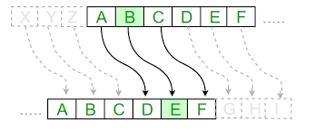

# Cipher

## Authors
Varun Peesapati

## Introduction
The code is written in Java and implements the **Caesar Cipher** (also known as
**shift cipher**), which is a type of substitution cipher in which each letter
in the plain text is replaced by a letter some fixed number of positions down
the alphabet. For example, if the offset is set to 3, then A becomes D, B
becomes E, and so on.



## Organization of Code
```
$ tree .
.
├── Cipher.java
├── cipher.png
├── Driver.java
├── Makefile
└── README.md
```
As seen above, the code pertaining to this problem is organized in a single
directory, with the code related to encryption and decryption present in 
`Cipher.java`. On the other hand, `Driver.java` is used to test the
implementation of the cipher and was linked together with `Cipher.java` by the 
`Makefile`.

## Usage
The program can be executed as follows:
```
$ make
javac *.java
$ java Driver
Enter a string that has to be encrypted: bob
Enter the offset by which the string needs to be encrypted by: 5
Encrypted String: gtg
Decrypted String: bob
```